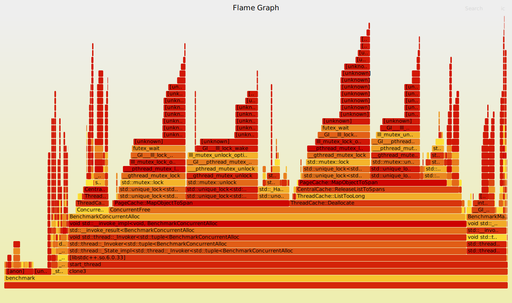
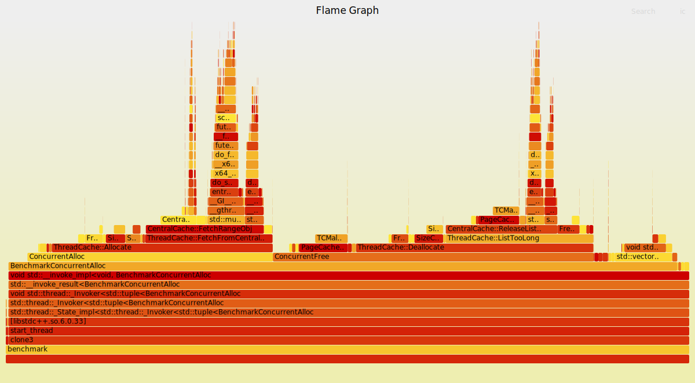

# 高性能高并发内存池（仿tcmalloc）

参考: https://blog.csdn.net/m0_62782700/article/details/135443352

## 难题
1. 锁竞争
2. 内存碎片

## 整体框架

- tc - thread cache
- cc - central cache
- pc - page cache

TCmalloc架构：


### Thread Cache

TC的数量和线程数相等，每个线程都有自己的tc，用于小内存分配，单次上限256KB；如果超过256KB，使用其他申请方式。线程内部申请无需加锁，可以解决很大一部分锁竞争问题。

单次256KB其实已经很大了，相当于分配了`int[65536]`。

### Central Cache

线程tc的空间用完后，向CC申请空间。
这时候可能会有锁竞争问题，cc内部使用hash桶实现，每个桶一个锁，只有两个线程同时申请一个桶才会出现线程安全问题，申请不同的桶获取不同的锁，不存在锁竞争。

为了提高内存利用率，cc会在合适的时机收回tc的内存，给其他需要内存的线程去用。


### Page Cache
cc中空间不够用会向Page Cache申请，同时pc也会解决cc中的内存碎片问题。

PC中有很多叫作span的结构体（span list），span中管理多个页大小的空间，而且通过一些方式去标记这些span，当几个页的内存都回来后pc就回收cc中满足条件的span。

页的大小一般为4KB或8KB，回收回来的页如果页号与其他页的页号是连号的，就可以合并，解决内存碎片问题。

## 实现

总体架构和v1版本类似，都是hash桶的思想。

### Thread Cache实现


[ThreadCache.h](./ThreadCache.h)

* ThreadCache
* FreeList

注意辅助函数要返回引用，才能修改
`static void*& ObjNext(void* obj)`


实现FreeList后，还需要估计ThreadCache的桶大小，这里就涉及一些计算和内存的相关知识。

1. 明显不能每种请求字节数设置一个桶，否则256KB要20多万个桶;也不太好相隔8B，3万多个还是有点多；
2. 这里其实是trade off: 用一定内部碎片换架构上的实现；
3. 这里选择控制10%内部碎片造成的空间浪费，使用如下对齐规则
    
| size 范围 |  对齐数 | hash桶下标 |
| - | - | - | 
| `[1,128]` | 8B | `freelist[0,16)` |
| `[128+1,1024]` | 16B | `freelist[16,72)` |
| `[1024+1, 8*1024]` | 128B | `freelist[72,128)` |
| `[8*1024+1, 64*1024]` | 1024B | `freelist[128, 184)` |
| `[64*1024+1, 256*1024]` | 8KB | `freelist[184, 208)` |

计算方法是，把用户请求的size对齐到下个对齐数的位置

这里空间浪费率，最大值应该是每个范围中的第一个，因为对齐后，浪费的内存量一定，但分配的内存量越来越大，即分母越来越大。

以请求1024+1B为例，这里匹配到第三行，对齐128B，分配大小是1024+128B的内存空间，浪费的是127B，浪费率为127/(1024+128) = 0.1102430556。


### Central Cache

cc对比tc
1. 相同点：数据结构相似，映射规则一样，也就是说桶下标一样。
2. 不同：有锁；tc是一块块的内存，cc中自由链表里是span结构体；

> span是管理页为单位的大块内存，就是说span中可以有多个页，span结构体中有一个`size_t`类型`_n`成员，表示span管理了多少页。
> span 挂在哪个桶下面就会将span总空间划分成多个对应桶表示的字节大小的空间。如挂在0号桶，就是把一个span划分成多个8B块，多个小块用链表连起来。
> span结构体中有一个`void* _list`表示划分好的多个小空间的头结点，tc就是用这个取小块内存的。

每个桶下挂的span中，页数不一样，越小的桶页数越少，这个可以理解，因为小块内存的数量也会多一点。

重要的是区分多个span管理的page的页号，理论需要有_pageId（后面说实现）

page链表是双向，而小块是单向的，因为span是双向链表实现，适合增删改查；
小块还是连续的内存

span中最后一个变量`size_t _usecount`用出多少块，既可以用来计数，判断是否满了，也可以方便把span还给pc，拼成更大的页，解决内部碎片。


这里先实现`Span`和`SpanList`，它们是链表节点和双向链表

然后实现`CentralCache`，主要是通过饿汉单例模式实现。

然后实现TC中从CC取内存块的逻辑，注意不要忘记留下一块给线程用（申请时没有空位）.

实现`FetchRangeObj`

### bug1 系统页和内存池页不对齐
内存池是8KB每页，Ubuntu系统默认4KB每页，使用mmap分配内存时可能会导致页没有对齐，导致页号计算出错导致对span内存块切割出错。表现为start指针相对于真正页开头提前了4kb，访问了超过内存的地址，造成coredump。
这个bug在调试模式是无法触发的，因为内存一定可以对齐。

### bug2 unordered_map线程不安全问题
在函数MapObjectToSpan使用的是unordered_map，这是线程不安全的，如果在执行这个函数时有线程在修改它，很容易触发线程安全问题。
解决方案就是加锁（性能又一次降低）


## 后续优化方式

目前和malloc差距还很大
```
================================================
4 threads || 10 rounds || 10000 malloc : cost 59770 ms
4 threads || 10 rounds || 10000 free : cost 46479 ms
4 threads || 10 rounds || 10000 malloc&free : cost 106249 ms


4 threads || 10 rounds || 10000 ConcurrentAlloc : cost 788717 ms
4 threads || 10 rounds || 10000 ConcurrentFree : cost 3407581 ms
4 threads || 10 rounds || 10000 ConcurrentAlloc&ConcurrentFree : cost 4196298 ms
================================================
```

### 使用专业性能测试工具进行测试

#### perf 手动采集

[BUG] Ubuntu 6.14.0-33-generic 在apt-get 安装了指定的版本后无法运行，是一个挺久的[bug](https://askubuntu.com/questions/1553558/cannot-call-perf-on-ubntu-24-04)

可以使用论坛里提供的[脚本](https://gist.github.com/karlivory/9111f906f4eb06370b2b237c62a6b00e)(也就是本仓库build-perf.sh)自行编译perf。

```shell
# 采集数据
sudo perf record -F 99 -g --call-graph dwarf ./benchmark &
# 绘制火焰图
cd ./build && sudo perf script | ./FlameGraph/stackcollapse-perf.pl | ./FlameGraph/flamegraph.pl > flamegraph.svg
```


#### CLion 使用性能分析器
参考
https://www.jetbrains.com/help/clion/2025.2/cpu-profiler.html#Prerequisites

### perf 报告分析
```
Samples: 637  of event 'cycles:P', Event count (approx.): 172760003
Overhead  Command    Shared Object         Symbol
  11.56%  benchmark  [unknown]             [k] 0xffffffffb96001bd                                                             ◆
   4.88%  benchmark  [unknown]             [k] 0xffffffffb960009c                                                             ▒
   3.87%  benchmark  libc.so.6             [.] pthread_mutex_lock@@GLIBC_2.2.5                                                ▒
   3.71%  benchmark  libc.so.6             [.] pthread_mutex_unlock@@GLIBC_2.2.5                                              ▒
   3.33%  benchmark  [unknown]             [k] 0xffffffffb96001b4                                                             ▒
   2.81%  benchmark  libc.so.6             [.] __GI___lll_lock_wait                                                           ▒
   1.85%  benchmark  [unknown]             [k] 0xffffffffb9415f96                                                             ▒
   1.67%  benchmark  [unknown]             [k] 0xffffffffb843505b
```

发现程序存在比较明显的锁竞争。绘制火焰图后


可以看到`MapOpjectToSpan`存在明显性能问题，主要原因就是互斥锁的使用导致锁竞争激烈。

### 基数树优化

tcmalloc使用基数树替代了`unordered_map`，但是64位机不能使用单层基数树，必须使用三层，只能以后实现。


### 使用基数树进行优化unordered_map

```
================================================
4 threads || 10 rounds || 10000 malloc : cost 73758 ms
4 threads || 10 rounds || 10000 free : cost 49652 ms
4 threads || 10 rounds || 10000 malloc&free : cost 123410 ms


4 threads || 10 rounds || 10000 ConcurrentAlloc : cost 281463 ms
4 threads || 10 rounds || 10000 ConcurrentFree : cost 187484 ms
4 threads || 10 rounds || 10000 ConcurrentAlloc&ConcurrentFree : cost 468947 ms
================================================
```

优化后benchmark提升明显，速度提升约88%，但还无法超过malloc，火焰图



